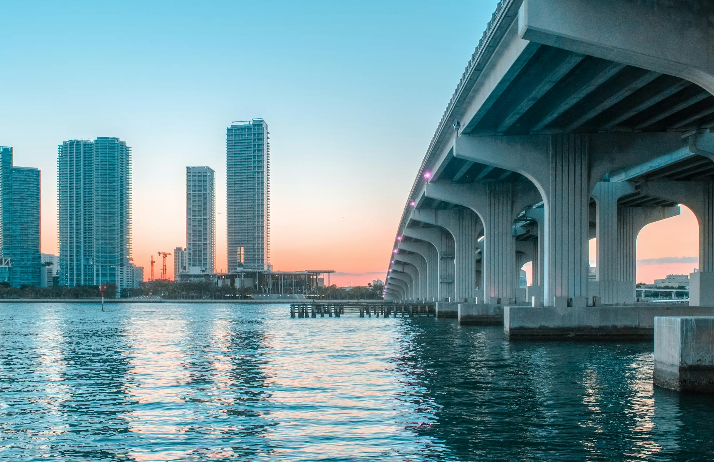

# Copy City Images - Instructions

## Quick Guide

You have 44 city images that need to be copied to your website project.

---

## Step 1: Copy Images (Windows)

### Option A: Using File Explorer (Easiest)

1. Open File Explorer
2. Navigate to: `C:\Users\james\Image_Scraper\images\cities\`
3. Select all `.jpg` files (NOT the `scraping_log.json` file)
4. Copy them (Ctrl+C)
5. Navigate to your project: `C:\Users\james\medspaflywheel\images\cities\`
   - If the `images\cities\` folder doesn't exist, create it first
6. Paste the files (Ctrl+V)

### Option B: Using PowerShell/Command Prompt

Open PowerShell in your project directory and run:

```powershell
# Create the directory if it doesn't exist
New-Item -ItemType Directory -Force -Path "images\cities"

# Copy all JPG files
Copy-Item "C:\Users\james\Image_Scraper\images\cities\*.jpg" -Destination "images\cities\"

# Verify files were copied
Get-ChildItem "images\cities\" | Measure-Object
```

You should see **44 files** copied.

---

## Step 2: Verify Files Were Copied

In PowerShell or Command Prompt:

```powershell
cd C:\Users\james\medspaflywheel\images\cities
dir *.jpg | Measure-Object
```

**Expected output:** Count = 44

---

## Step 3: Update HTML Landing Pages (WSL/Linux Terminal)

After copying the images, run the update script from WSL or your Linux terminal:

```bash
cd /home/user/medspaflywheel

# Make the script executable
chmod +x scripts/update-city-images.py

# Run the script
python3 scripts/update-city-images.py
```

**Expected output:**
```
🚀 Starting city image update process...

Updating alpharetta-ga.html...
  ✅ Updated: alpharetta-ga.html
Updating arlington-va.html...
  ✅ Updated: arlington-va.html
[... 42 more ...]

============================================================
📊 SUMMARY
============================================================
✅ Successfully updated: 44 pages
⚠️  Not updated: 0 pages
📁 Total: 44 city landing pages
============================================================
```

---

## Step 4: Test Locally

Test one or two pages to make sure images display correctly:

```bash
# Start a local server
npm run dev

# Open in browser: http://localhost:8000/miami-fl.html
```

Check that:
- ✅ Image loads correctly
- ✅ Image looks good (not stretched or distorted)
- ✅ Alt text is appropriate
- ✅ Image is responsive on mobile

---

## Step 5: Commit and Deploy

Once you've verified the images look good:

```bash
git add images/cities/*.jpg
git add *-*.html
git commit -m "Add hero images to all 44 city landing pages"
git push
```

Vercel will automatically deploy the updated site!

---

## Image Details

### Files Being Copied (44 images)

| Image | Size | City |
|-------|------|------|
| alpharetta-ga.jpg | 320 KB | Alpharetta, GA |
| arlington-va.jpg | 197 KB | Arlington, VA |
| asheville-nc.jpg | 112 KB | Asheville, NC |
| athens-ga.jpg | 471 KB | Athens, GA |
| atlanta-ga.jpg | 109 KB | Atlanta, GA |
| augusta-ga.jpg | 103 KB | Augusta, GA |
| birmingham-al.jpg | 120 KB | Birmingham, AL |
| boca-raton-fl.jpg | 426 KB | Boca Raton, FL |
| cary-nc.jpg | 123 KB | Cary, NC |
| chapel-hill-nc.jpg | 225 KB | Chapel Hill, NC |
| charleston-sc.jpg | 139 KB | Charleston, SC |
| charlotte-nc.jpg | 155 KB | Charlotte, NC |
| chattanooga-tn.jpg | 154 KB | Chattanooga, TN |
| chesapeake-va.jpg | 130 KB | Chesapeake, VA |
| clearwater-fl.jpg | 135 KB | Clearwater, FL |
| columbia-sc.jpg | 36 KB | Columbia, SC |
| columbus-ga.jpg | 197 KB | Columbus, GA |
| durham-nc.jpg | 60 KB | Durham, NC |
| fort-lauderdale-fl.jpg | 95 KB | Fort Lauderdale, FL |
| franklin-tn.jpg | 106 KB | Franklin, TN |
| greensboro-nc.jpg | 120 KB | Greensboro, NC |
| greenville-sc.jpg | 155 KB | Greenville, SC |
| hilton-head-sc.jpg | 81 KB | Hilton Head, SC |
| huntsville-al.jpg | 159 KB | Huntsville, AL |
| jacksonville-fl.jpg | 90 KB | Jacksonville, FL |
| knoxville-tn.jpg | 88 KB | Knoxville, TN |
| memphis-tn.jpg | 167 KB | Memphis, TN |
| miami-fl.jpg | 320 KB | Miami, FL |
| mobile-al.jpg | 105 KB | Mobile, AL |
| montgomery-al.jpg | 89 KB | Montgomery, AL |
| myrtle-beach-sc.jpg | 206 KB | Myrtle Beach, SC |
| naples-fl.jpg | 258 KB | Naples, FL |
| nashville-tn.jpg | 454 KB | Nashville, TN |
| norfolk-va.jpg | 484 KB | Norfolk, VA |
| orlando-fl.jpg | 241 KB | Orlando, FL |
| raleigh-nc.jpg | 295 KB | Raleigh, NC |
| richmond-va.jpg | 273 KB | Richmond, VA |
| sandy-springs-ga.jpg | 191 KB | Sandy Springs, GA |
| sarasota-fl.jpg | 241 KB | Sarasota, FL |
| savannah-ga.jpg | 264 KB | Savannah, GA |
| tampa-fl.jpg | 358 KB | Tampa, FL |
| virginia-beach-va.jpg | 251 KB | Virginia Beach, VA |
| west-palm-beach-fl.jpg | 259 KB | West Palm Beach, FL |
| winston-salem-nc.jpg | 284 KB | Winston-Salem, NC |

**Total Size:** ~8.5 MB (all images)

---

## What the Script Does

The `update-city-images.py` script will:

1. ✅ Find all 44 city landing pages
2. ✅ Replace the gradient placeholder div with an actual `` tag
3. ✅ Set the correct image path (e.g., `images/cities/miami-fl.jpg`)
4. ✅ Add proper alt text (e.g., "Med Spa Services in Miami, FL")
5. ✅ Maintain responsive design (aspect-[4/3], rounded corners, shadow)
6. ✅ Report which pages were successfully updated

### Before (Placeholder):
```html
<div class="aspect-[4/3] bg-gradient-to-br from-primary-200 via-primary-300 to-accent-200 rounded-2xl overflow-hidden shadow-2xl">
    <div class="w-full h-full flex flex-col items-center justify-center p-8 text-center">
        <svg>...</svg>
        <p>Miami Location Hero Image</p>
        <p>Replace with Miami landmark or aesthetic clinic photo</p>
    </div>
</div>
```

### After (Real Image):
```html
<div class="aspect-[4/3] rounded-2xl overflow-hidden shadow-2xl">
    
</div>
```

---

## Troubleshooting

### Issue: "Images not found" error when testing

**Solution:** Make sure you copied the images to the correct directory:
```
medspaflywheel/
└── images/
    └── cities/
        ├── miami-fl.jpg
        ├── atlanta-ga.jpg
        └── [42 more images...]
```

### Issue: "Permission denied" when running script

**Solution:** Make the script executable:
```bash
chmod +x scripts/update-city-images.py
```

### Issue: Images look stretched or distorted

**Solution:** The images should be landscape orientation (wider than tall). The `aspect-[4/3]` class maintains a 4:3 aspect ratio, and `object-cover` ensures proper cropping without distortion.

If an image looks bad, you may need to edit it or find a better version.

### Issue: Script reports "pattern not found"

**Solution:** The HTML structure may have changed. Check one of the city files manually to see the current placeholder structure, then update the regex pattern in the script.

---

## Need Help?

If you encounter any issues:
1. Check that all 44 images are in `images/cities/`
2. Make sure you're running the script from the project root
3. Verify Python 3 is installed: `python3 --version`
4. Check the script output for specific error messages

---

**Ready to proceed?**

1. Copy the images (Step 1)
2. Run the script (Step 3)
3. Test locally (Step 4)
4. Deploy! (Step 5)

🚀 Your city landing pages will look professional with real hero images!
